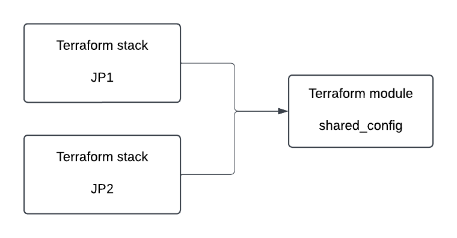

# Terraform multi-stack example

The aim of this project is to demonstrate how to create the same set of resources on multiple JFrog Platform Deployment using terraform.

In this example, commons resources have been declared in a terraform module. Terraform module allows to encapsulate complexity in one place and ease it utilization across multiple stacks

Once terraform stack have been created for each JPD. They all reference the module to deploy common resources.

## Usage

To deploy resources, check the **README.md** in each repository

## Potential improvements

In order to improve this project and make it production ready, you can do the followings tasks:

- Update the backend configuration to rely on a more suitable solution (S3, GCS, etc...)
- Host the terraform module on Git to ease the deployment (Github, Gitlab, etc..)