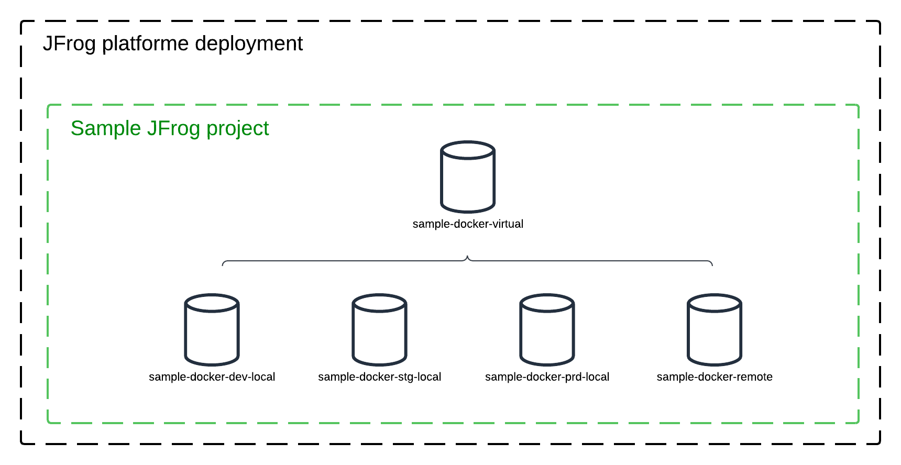

# Shared config Terraform module

This module aim to deploy a sample project with :

- 3 docker local repository (dev, stg, prod)
- 1 remote docker repository
- 1 virtual docker repository that aggregate all other repositories



# Usage
This module must be integrated in a terraform stack as follows

```
module "shared_configuration" {
  source = "<PATH_TO_MODULE>"
  jfrog_url = <JFROG PLATFORM URL>
}
```

Make sure that the environment variable ```JFROG_ACCESS_TOKEN``` is set to deploy Terraform resources on the targeted JPD

<!-- BEGIN_TF_DOCS -->
## Requirements

| Name | Version |
|------|---------|
| <a name="requirement_artifactory"></a> [artifactory](#requirement\_artifactory) | 12.5.1 |
| <a name="requirement_project"></a> [project](#requirement\_project) | 1.9.1 |

## Providers

| Name | Version |
|------|---------|
| <a name="provider_artifactory"></a> [artifactory](#provider\_artifactory) | 12.5.1 |
| <a name="provider_project"></a> [project](#provider\_project) | 1.9.1 |

## Modules

No modules.

## Resources

| Name | Type |
|------|------|
| [artifactory_local_docker_v2_repository.sample_docker_dev](https://registry.terraform.io/providers/jfrog/artifactory/12.5.1/docs/resources/local_docker_v2_repository) | resource |
| [artifactory_local_docker_v2_repository.sample_docker_prd](https://registry.terraform.io/providers/jfrog/artifactory/12.5.1/docs/resources/local_docker_v2_repository) | resource |
| [artifactory_local_docker_v2_repository.sample_docker_stg](https://registry.terraform.io/providers/jfrog/artifactory/12.5.1/docs/resources/local_docker_v2_repository) | resource |
| [artifactory_remote_docker_repository.sample_docker_remote](https://registry.terraform.io/providers/jfrog/artifactory/12.5.1/docs/resources/remote_docker_repository) | resource |
| [artifactory_virtual_docker_repository.sample_docker_virtual](https://registry.terraform.io/providers/jfrog/artifactory/12.5.1/docs/resources/virtual_docker_repository) | resource |
| [project_project.sample](https://registry.terraform.io/providers/jfrog/project/1.9.1/docs/resources/project) | resource |
| [project_repository.sample_docker_dev](https://registry.terraform.io/providers/jfrog/project/1.9.1/docs/resources/repository) | resource |
| [project_repository.sample_docker_prd](https://registry.terraform.io/providers/jfrog/project/1.9.1/docs/resources/repository) | resource |
| [project_repository.sample_docker_remote](https://registry.terraform.io/providers/jfrog/project/1.9.1/docs/resources/repository) | resource |
| [project_repository.sample_docker_stg](https://registry.terraform.io/providers/jfrog/project/1.9.1/docs/resources/repository) | resource |
| [project_repository.sample_docker_virtual](https://registry.terraform.io/providers/jfrog/project/1.9.1/docs/resources/repository) | resource |

## Inputs

| Name | Description | Type | Default | Required |
|------|-------------|------|---------|:--------:|
| <a name="input_jfrog_url"></a> [jfrog\_url](#input\_jfrog\_url) | JFrog platform URL | `string` | n/a | yes |

## Outputs

| Name | Description |
|------|-------------|
| <a name="output_docker_virtual_key"></a> [docker\_virtual\_key](#output\_docker\_virtual\_key) | n/a |
| <a name="output_project_key"></a> [project\_key](#output\_project\_key) | n/a |
<!-- END_TF_DOCS -->